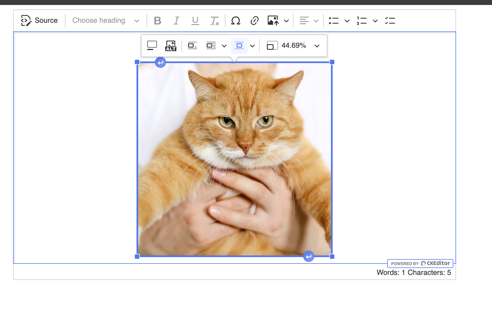

# CKEditor 5 Sample Project

## Setup instructions

### 1. Install dependencies

To get started, install the necessary npm packages:

```sh
npm install
```

### 2. Start the project

Run the following command to start the project:

```sh
npm run start
```

And open the project in the browser.

### UI Example

Here is an example of the UI:



---

For more information, please refer to the official [CKEditor 5 documentation](https://ckeditor.com/docs/ckeditor5/latest/getting-started/index.html).

